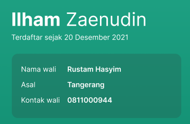
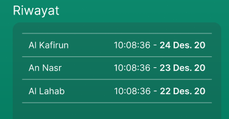

# Get User Detail
 

**URL** : GET `/api/users/username/:username/report`

**RESPONSE** :
```json
{
  "code": 200,
  "message": "ok",
  "status": "success",
  "data": [
    {
      "id" : "asdnasdqwjenkjnk2enk",
      "name": "[user name]",
      "username": "[valid username address]",
      "password": "[password in plain text, can be empty if user type is STUDENT]",
      "guardian": "[parents or wali name, must be filled if type is STUDENT]",
      "userPhone": "[plain text]",
      "guardianPhone": "[plain text], must be filled if type is STUDENT",
      "birthDate": "[DD-MM-YYYY, must be filled if type is STUDENT]",
      "city": "[plain text, must be filled if type is STUDENT]",
      "role": "[TEACHER, STUDENT, ADMIN]",
      "lastEducation": "[must be filled if type is TEACHER]"
    }
  ]
}
```

# Get Quran Progress


**URL** : GET `/api/quran-progress/user/:userId/progress/report`

**RESPONSE** :
```json
{
  "code": 200,
  "message": "ok",
  "status": "success",
  "data": [
    {
    "userId": "[id from table user, numeric only]",
    "totalSurat": "INT",
    "surat": "INT",
    "ayat": "INT"
    }
  ]
}
```

# Count Quran Progress by Method


**URL** : GET `/api/quran-progress/user/:userId/method/count/report`

**RESPONSE** :
```json
{
  "code": 200,
  "message": "ok",
  "status": "success",
  "data": [
    {
    "method": "[plain text]",
    "total": "[plain text]"
    }
  ]
}
```

# Get Quran History


**URL** : GET `/api/quran-progress/user/:userId/report`

**RESPONSE** :
```json
{
  "code": 200,
  "message": "ok",
  "status": "success",
  "data": [
    {
    "id": "[plain text]",
    "createdDate": "DATE",
    "surat": "[plain text]",
    "ayat": "INT",
    "juz": "INT",
    "userid": "[id from table user, numeric only]",
    "method": "[SABAQ, MANZIL, SABAQI]"
    }
  ]
}
```